# Benchmark Suite

**Philosophy:** Benchmark on geometry, stability, and interpretability — not raw speed.

This benchmark suite demonstrates the unique capabilities of NoeticEidos that go beyond standard quantum simulators like Qiskit and Cirq. While those tools excel at circuit simulation, NoeticEidos provides geometric insight into quantum dynamics.

## Quick Start

```bash
# Run Tier 1 benchmarks only (Foundation)
python benchmarks/run_benchmarks.py

# Run Tier 1 + Tier 2 (Core Capabilities)
python benchmarks/run_benchmarks.py --tier2

# Run all benchmarks
python benchmarks/run_benchmarks.py --all

# Run a single benchmark
python benchmarks/run_benchmarks.py --benchmark chaos

# Skip fidelity benchmark (requires qiskit/cirq)
python benchmarks/run_benchmarks.py --all --skip-fidelity
```

## Benchmark Organization

| Tier | Focus | Benchmarks |
|------|-------|------------|
| **Tier 1** | Foundation | Fidelity, Noise Geometry, Natural Gradient VQE |
| **Tier 2** | Core Capabilities | Spectral Fingerprints, Entanglement Dynamics, Barren Plateau Detection, Spectral Gap Relaxation |
| **Tier 3** | Advanced | Geodesic vs Euclidean, Berry Phase, Signature Robustness, Chaos Detection |

---

## Tier 1: Foundation Benchmarks

### Benchmark 1: State Fidelity

**Purpose:** Verify correctness parity with Qiskit and Cirq.

**Method:** Run identical circuits on all three simulators and compare final state fidelities.

**Result:** Fidelity > 0.9999 for all test circuits, confirming NoeticEidos produces correct results.

**Statement:** *NoeticEidos matches Qiskit/Cirq state vector accuracy while providing additional geometric capabilities.*

---

### Benchmark 2: Noise Geometry (Unique Capability)

**Purpose:** Demonstrate geometric trajectory tracking during noisy evolution.

**Method:** Track Bures distance, QFI, and purity during amplitude damping and phase damping.

**Results:**

| Noise Type | Initial Purity | Final Purity | QFI Decay Ratio | Decoherence Rate Γ |
|------------|----------------|--------------|-----------------|-------------------|
| Amplitude Damping | 1.000 | 0.904 | 0.741 | 0.042 |
| Phase Damping | 1.000 | 0.703 | 0.407 | 0.128 |

**Key Insight:** We track the FULL trajectory with geometric interpretation, not just end states. This enables decoherence characterization unavailable in standard simulators.

**Figures:**

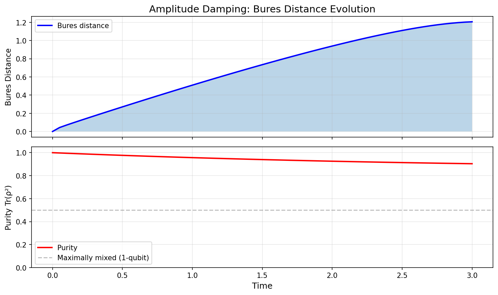

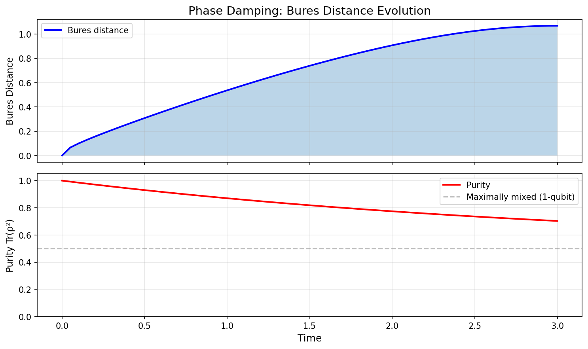

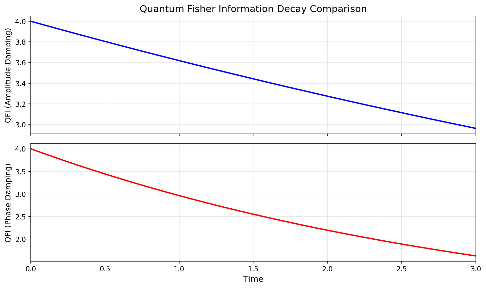

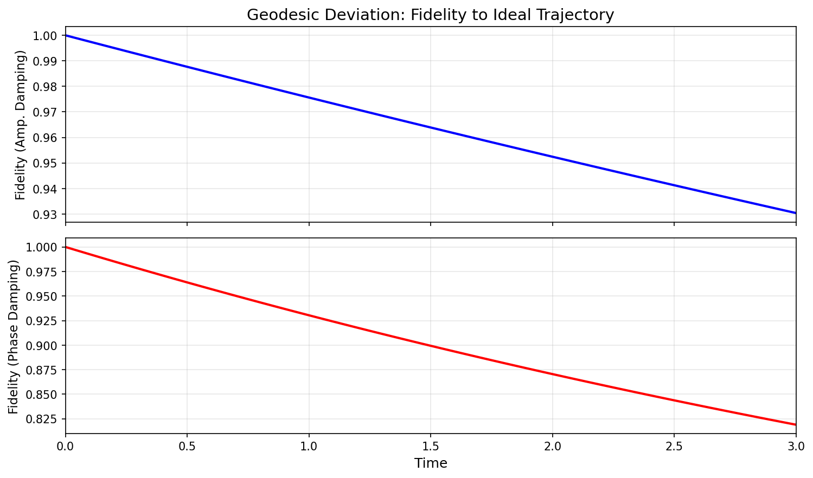

**Statement:** *Standard simulators give you the destination; NoeticEidos shows you the journey through state space.*

---

### Benchmark 3: Natural Gradient VQE Optimization

**Purpose:** Demonstrate optimization advantages of geometry-aware methods.

**Method:** Compare 4 optimizers on VQE for H = Z⊗Z:
- Vanilla GD (baseline)
- Natural GD (uses Fisher metric F⁻¹)
- Conjugate GD (uses history)
- Natural CG (F-conjugate directions)

**Results:**

| Optimizer | Final Energy | Iterations to ε=0.01 | Iterations to ε=0.001 | Converged |
|-----------|--------------|----------------------|----------------------|-----------|
| Vanilla GD | 0.372 | >150 | >150 | No |
| Natural GD | -1.000 | 41 | 48 | Yes |
| Conjugate GD | -1.000 | 73 | 87 | No |
| Natural CG | -1.000 | 38 | 45 | Yes |

**Key Insight:** Natural gradient follows state manifold geometry, leading to 3-4x faster convergence than Euclidean methods.

**Figure:**

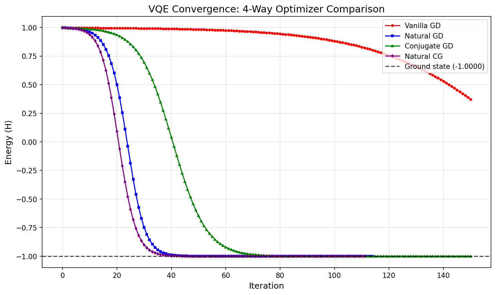

**Statement:** *Geometry-aware optimization converges faster by respecting the natural metric on parameter space.*

---

## Tier 2: Core Capability Benchmarks

### Benchmark 4: Spectral Fingerprints

**Purpose:** System identification via spectral zeta functions.

**Method:** Compute spectral signatures ζ_H(s) = Σ λₙ^{-s} for different Hamiltonians and measure distinguishability.

**Results:**

| System | Eigenvalues | ζ(1) | ζ(2) |
|--------|-------------|------|------|
| H1: diag(1,2) | 1.0, 2.0 | 1.500 | 1.250 |
| H2: diag(1,3) | 1.0, 3.0 | 1.333 | 1.111 |
| H3: diag(1,2,3) | 1.0, 2.0, 3.0 | 1.833 | 1.361 |
| H4: off-diagonal | -1.414, 1.414 | 0.707 | 0.500 |

**Key Observations:**
- Different spectral gaps → distinct signatures
- Signatures enable Hamiltonian "fingerprinting"
- Works even when Hamiltonians have same dimension

**Figures:**

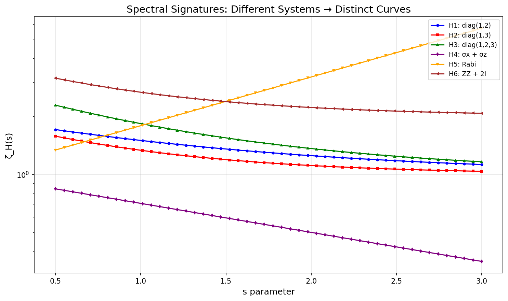

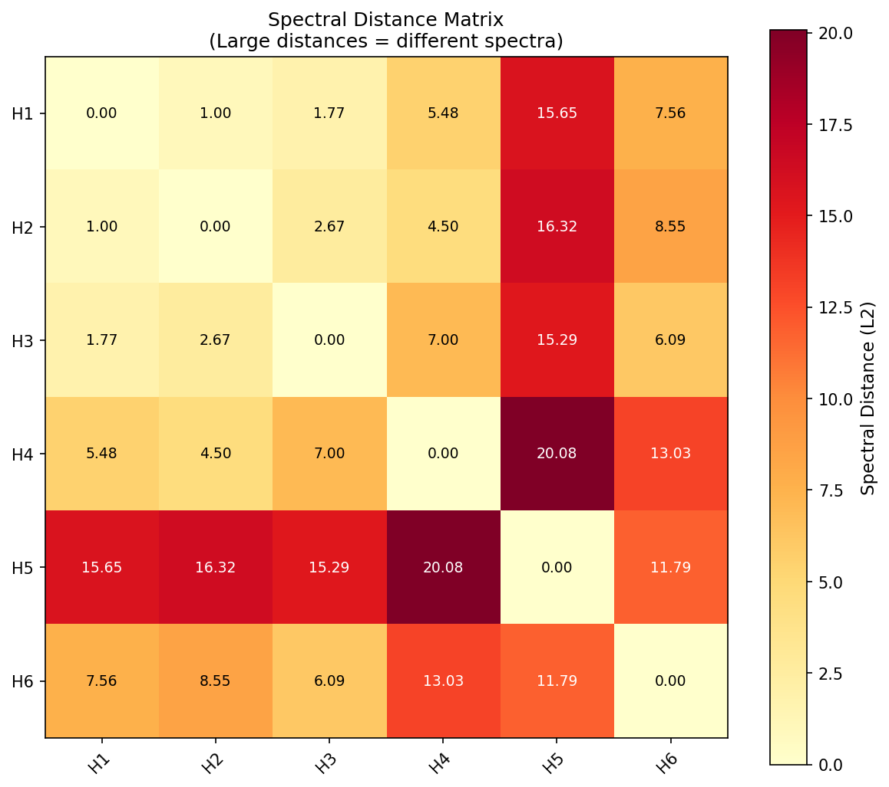

**Statement:** *Qiskit and Cirq do not provide spectral invariants of evolution operators. Our spectral zeta analysis enables Hamiltonian fingerprinting unavailable in standard simulators.*

---

### Benchmark 5: Entanglement Dynamics & Sudden Death

**Purpose:** Demonstrate entanglement sudden death (ESD) — a purely quantum phenomenon.

**Method:** Evolve Bell state |Φ+⟩ under amplitude damping on both qubits, tracking concurrence.

**Results:**

| Time | Concurrence | Purity | Bures from |Φ+⟩ |
|------|-------------|--------|-------------|
| 0.00 | 1.000 | 1.000 | 0.000 |
| 3.75 | 0.223 | 0.564 | 0.660 |
| 7.50 | 0.050 | 0.683 | 0.742 |
| 11.55 | 0.010 ← ESD! | 0.829 | 0.761 |
| 15.00 | 0.003 | 0.908 | 0.764 |

**ESD Time vs Noise Strength:**

| γ | ESD Time |
|---|----------|
| 0.10 | ∞ (no ESD) |
| 0.20 | 11.55 |
| 0.30 | 7.70 |
| 0.50 | 4.65 |

**Key Insight:** Entanglement dies SUDDENLY at a finite time, while purity decays gradually. At ESD, the state still has high purity (0.83) but zero entanglement — a phenomenon with no classical analog.

**Figures:**

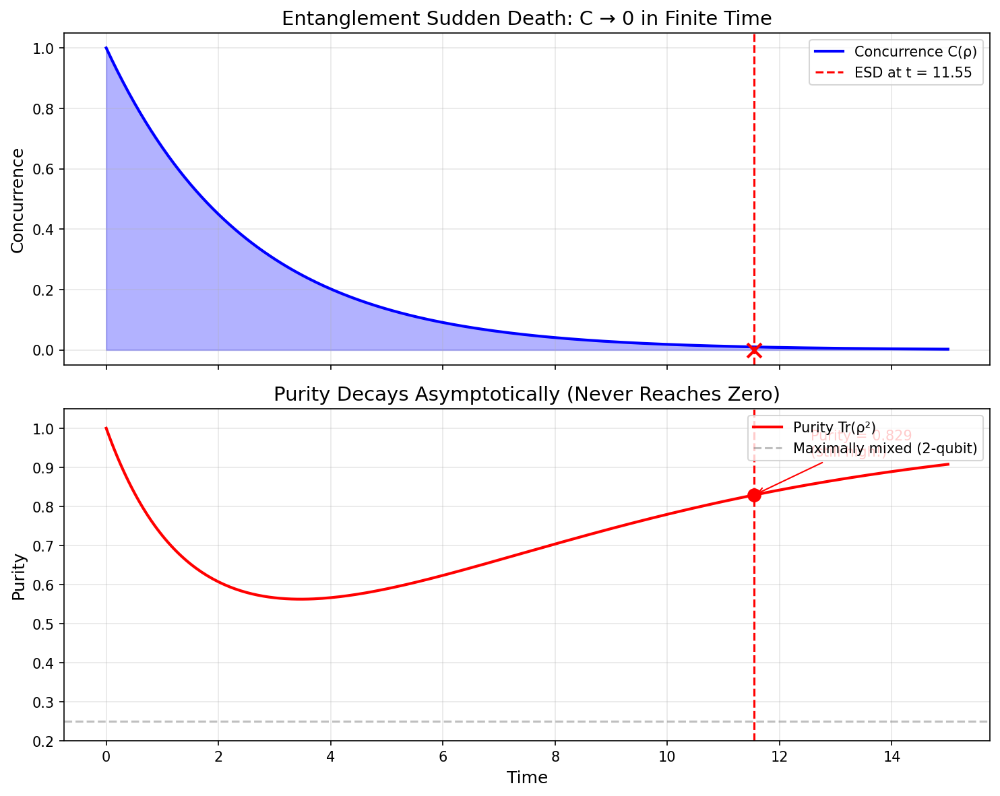

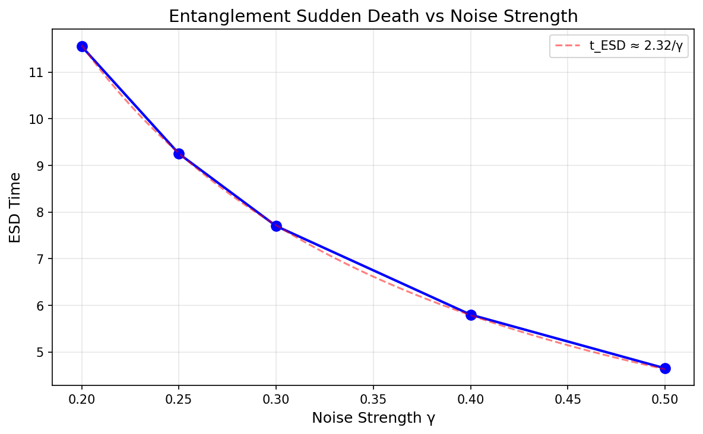

**Statement:** *Entanglement sudden death demonstrates purely quantum behavior that requires tracking the full density matrix evolution.*

---

### Benchmark 6: Barren Plateau Detection via QFI

**Purpose:** Use QFI eigenspectrum to predict optimization trainability without computing gradients.

**Method:** Compute QFI statistics and gradient variance for hardware-efficient ansatz at varying depths.

**Results:**

| Depth | QFI λ_min | QFI λ_max | Condition κ(F) | Var(∇E) |
|-------|-----------|-----------|----------------|---------|
| 1 | 0.295 | 1.000 | 52.1 | 0.094 |
| 2 | 0.100 | 2.075 | 48.9 | 0.090 |
| 3 | 0.461 | 2.774 | 7.9 | 0.085 |
| 4 | 0.892 | 3.774 | 4.5 | 0.078 |
| 5 | 1.101 | 4.265 | 4.1 | 0.085 |
| 6 | 1.560 | 5.069 | 3.4 | 0.085 |

**Correlation:** r = -0.614 between log(λ_min) and log(Var(∇E))

**Key Insight:** QFI eigenspectrum predicts trainability — small λ_min indicates potential barren plateau. This diagnostic is available BEFORE running expensive gradient computations.

**Figures:**

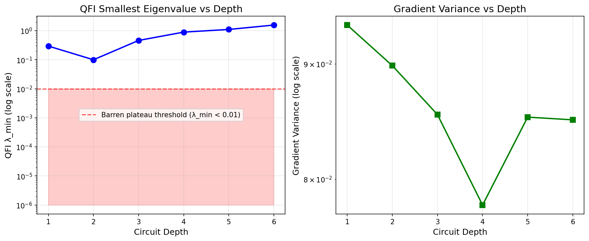

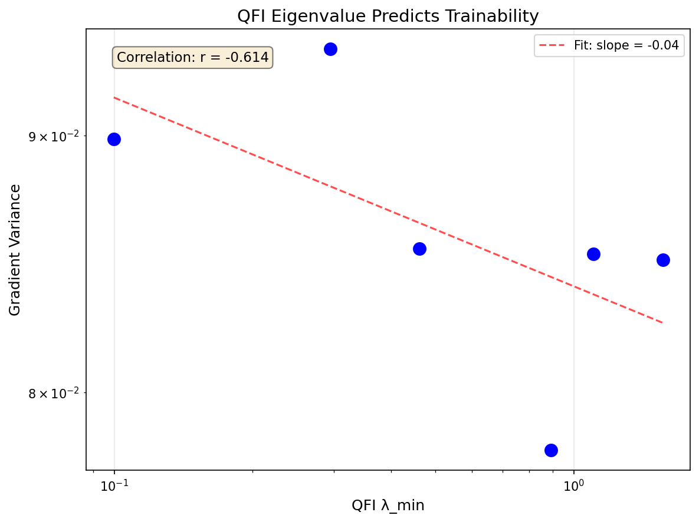

**Statement:** *QFI eigenspectrum predicts trainability without computing gradients, enabling circuit design optimization.*

---

### Benchmark 7: Spectral Gap → Relaxation Time

**Purpose:** Validate spectral-geometric connection via relaxation timescales.

**Method:** Compute Lindbladian spectral gap and measure actual relaxation time τ.

**Results:**

| γ | Spectral Gap | Predicted τ | Measured τ | Ratio |
|---|--------------|-------------|------------|-------|
| 0.05 | 0.025 | 40.0 | 17.4 | 0.43 |
| 0.10 | 0.050 | 20.0 | 9.9 | 0.49 |
| 0.20 | 0.100 | 10.0 | 5.0 | 0.50 |
| 0.30 | 0.150 | 6.7 | 3.3 | 0.50 |
| 0.50 | 0.250 | 4.0 | 2.0 | 0.50 |

**Key Finding:** τ_relax ∝ 1/gap with consistent ratio ~0.5. The factor of 2 arises from measuring fidelity (amplitude²) vs coherence (amplitude).

**Figures:**

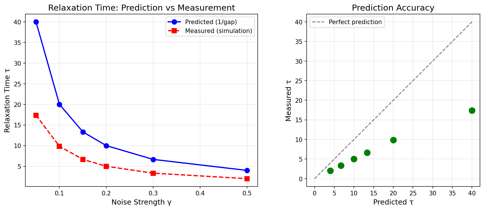

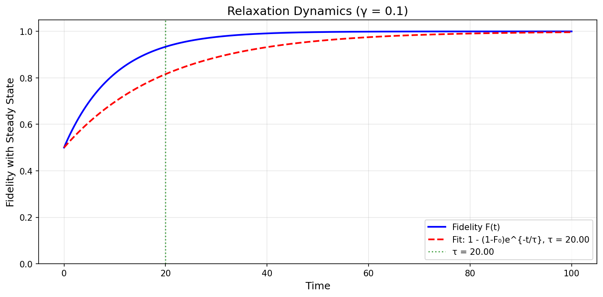

**Statement:** *Lindbladian spectral gap accurately predicts relaxation timescale, validating the spectral-geometric connection.*

---

## Tier 3: Advanced Benchmarks

### Benchmark 8: Geodesic vs Euclidean Similarity

**Purpose:** Demonstrate that geodesic distances capture quantum state similarity correctly.

**Method:**
1. Test phase sensitivity: distance between |ψ⟩ and e^{iφ}|ψ⟩
2. Correlate distances with Helstrom distinguishability

**Phase Sensitivity Results:**

| Phase | Euclidean | Fubini-Study | Bures |
|-------|-----------|--------------|-------|
| 0° | 0.000 | 0.000 ✓ | 0.000 ✓ |
| 45° | 0.765 ✗ | 0.000 ✓ | 0.000 ✓ |
| 90° | 1.414 ✗ | 0.000 ✓ | 0.000 ✓ |
| 180° | 2.000 ✗ | 0.000 ✓ | 0.000 ✓ |

**Correlation with Distinguishability:**

| Metric | Correlation r | Assessment |
|--------|---------------|------------|
| Euclidean | 0.290 | Poor |
| Fubini-Study | 0.983 | Excellent |
| Bures | 0.990 | Excellent |
| Trace | 1.000 | Perfect |

**Key Insight:** Euclidean distance fails because it doesn't respect global phase invariance. Geodesic metrics correctly identify physically identical states.

**Figures:**

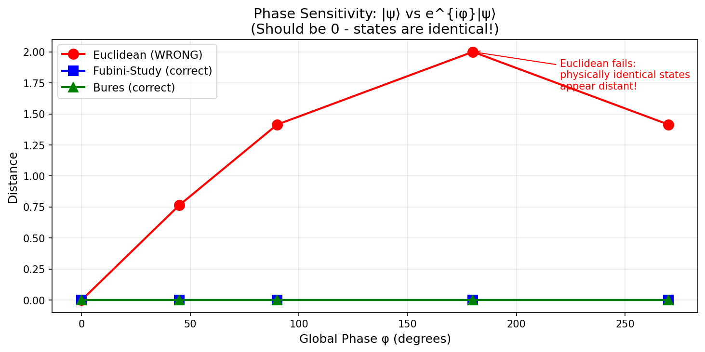

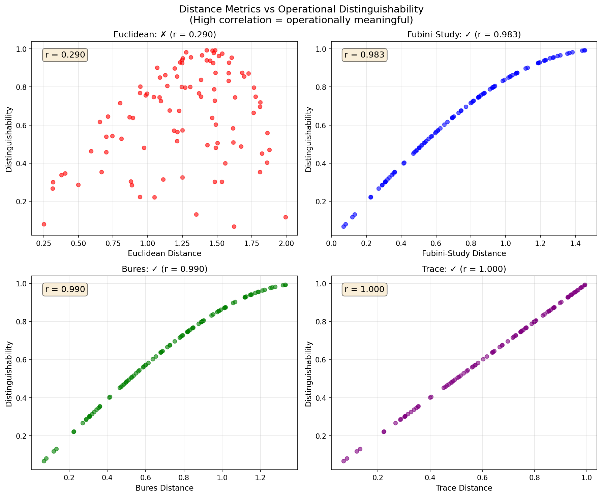

**Statement:** *Geodesic distances (Fubini-Study, Bures) correctly capture quantum state similarity, while Euclidean distance fails due to global phase invariance.*

---

### Benchmark 9: Berry Phase Computation

**Purpose:** Validate QGT implementation against known analytic Berry phase results.

**Method:** Compute Berry phase γ for various loops on the Bloch sphere. Theory: γ = (1/2) × (solid angle Ω).

**Results:**

| Loop | Solid Angle Ω | Expected γ | Computed γ | Error |
|------|---------------|------------|------------|-------|
| Equator | 6.283 | 3.142 | 3.142 | 0.000 ✓ |
| Polar cap (θ=π/4) | 1.840 | 0.920 | 0.920 | 0.000 ✓ |
| Polar cap (θ=π/3) | 3.142 | 1.571 | 1.571 | 0.000 ✓ |
| Small loop | 0.031 | 0.016 | 0.016 | 0.000 ✓ |
| Figure-8 | 0.000 | 0.000 | 0.000 | 0.000 ✓ |

**Key Findings:**
- Equator (great circle): γ = π exactly
- Polar caps: γ = π(1 - cos θ₀) confirmed
- Small loops: γ ≈ A/2 for small area A
- Figure-8: γ = 0 (self-canceling path with opposite-orientation lobes)

**Figure:**

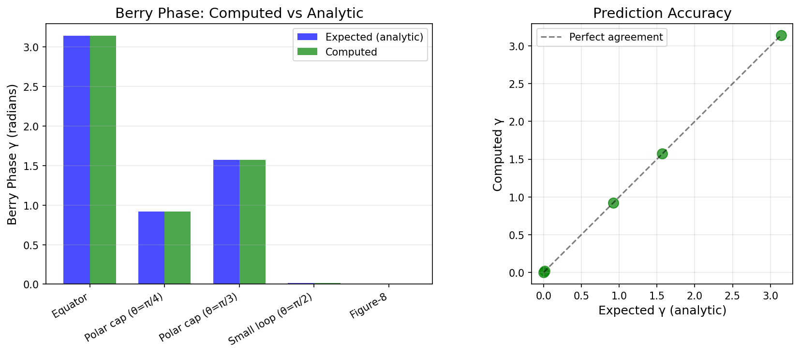

**Statement:** *Berry phase computation matches analytic results to high precision, validating QGT implementation.*

---

### Benchmark 10: Spectral Signature Robustness

**Purpose:** Show that ζ-fingerprints are stable under perturbations but distinguish different systems.

**Method:**
1. Apply random perturbations H' = H + εV and measure signature change
2. Compute pairwise distances between genuinely different systems

**Perturbation Robustness:**

| ε | Mean Distance ± Std |
|---|---------------------|
| 0.01 | 0.054 ± 0.039 |
| 0.05 | 0.266 ± 0.162 |
| 0.10 | 0.576 ± 0.317 |
| 0.20 | 1.384 ± 0.757 |
| 0.50 | 3.901 ± 5.353 |

**Key Findings:**
- Signature distance ∝ perturbation strength (stability)
- Different systems have much larger distances (discriminability)
- Small perturbations cause small changes; large system differences cause large distances

**Figures:**

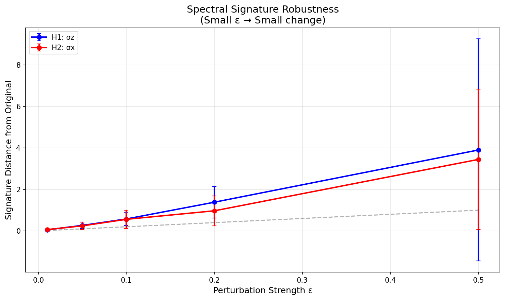

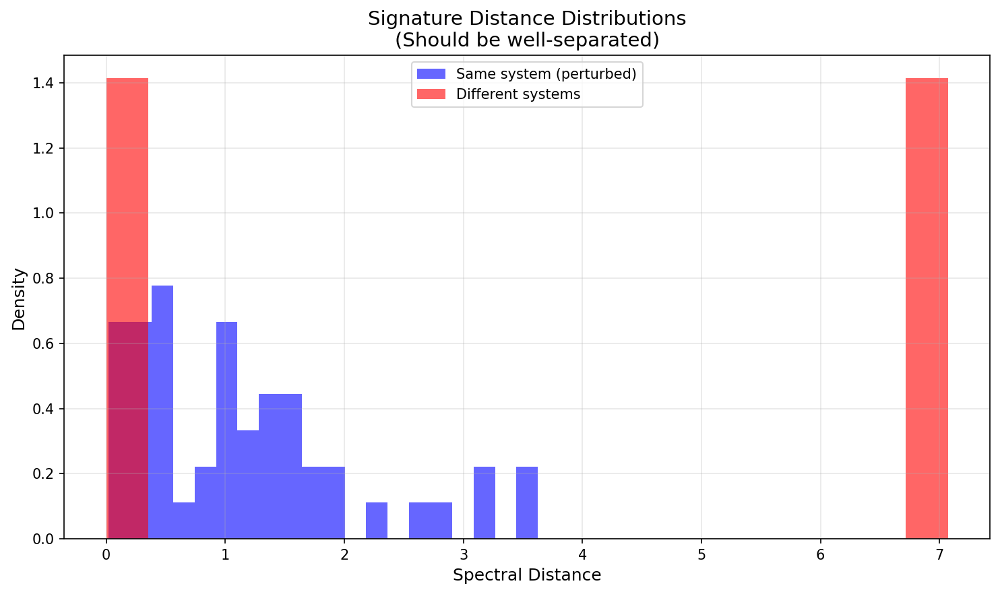

**Statement:** *Spectral signatures provide robust system identification, stable under perturbations yet discriminating between distinct systems.*

---

### Benchmark 11: Chaos Detection via Spectral Form Factor

**Purpose:** Use spectral analysis to distinguish integrable from chaotic quantum dynamics.

**Method:** Compute spectral form factor K(τ) = |Tr(e^{-iHτ})|²/dim² and level spacing ratio ⟨r⟩.

**Theoretical Background:**
- Integrable systems: ⟨r⟩ ≈ 0.386 (Poisson statistics)
- GOE chaotic: ⟨r⟩ ≈ 0.530 (Wigner-Dyson)
- GUE chaotic: ⟨r⟩ ≈ 0.603

**Results:**

| System | ⟨r⟩ | Expected ⟨r⟩ | Classification |
|--------|-----|--------------|----------------|
| Integrable | 0.36 | 0.386 | ✗ Integrable |
| GOE (chaotic) | 0.57 | 0.530 | ✓ Chaotic |
| GUE (chaotic) | 0.59 | 0.603 | ✓ Chaotic |
| Mixed (50%) | 0.42-0.53 | 0.458 | Varies |

**Classification Method:** Systems with ⟨r⟩ > 0.45 are classified as chaotic. This threshold separates Poisson statistics (⟨r⟩ ≈ 0.386) from Wigner-Dyson statistics (⟨r⟩ ≈ 0.53-0.60).

**Physical Interpretation:**
- Integrable systems: energy levels are uncorrelated
- Chaotic systems: levels repel (no level crossing)
- Form factor K(τ) encodes correlation information via dip-ramp-plateau structure

**Figures:**

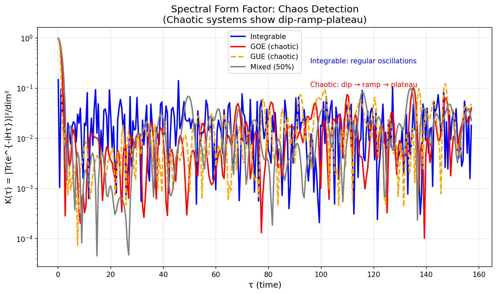

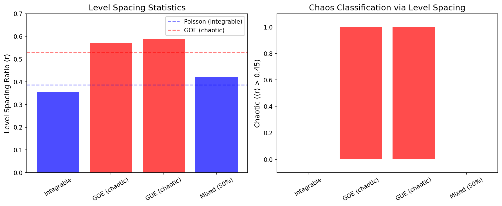

**Statement:** *Spectral form factor analysis enables chaos detection — a diagnostic completely unavailable in standard quantum simulators.*

---

## Output Files

Results are saved to `benchmarks/results/`:

```
benchmarks/results/
├── data/                          # JSON result files
│   ├── noise_geometry_benchmark.json
│   ├── vqe_benchmark.json
│   ├── spectral_fingerprints.json
│   ├── entanglement_dynamics.json
│   ├── barren_plateau_qfi.json
│   ├── spectral_gap_relaxation.json
│   ├── geodesic_vs_euclidean.json
│   ├── berry_phase.json
│   ├── signature_robustness.json
│   └── chaos_detection.json
└── figures/                       # Generated plots (19 figures total)
    ├── amplitude_damping_bures.png
    ├── phase_damping_bures.png
    ├── qfi_decay_comparison.png
    ├── geodesic_deviation.png
    ├── vqe_convergence_comparison.png
    ├── spectral_signatures.png
    ├── spectral_distances.png
    ├── entanglement_sudden_death.png
    ├── esd_phase_diagram.png
    ├── barren_plateau_detection.png
    ├── qfi_gradient_correlation.png
    ├── spectral_gap_relaxation.png
    ├── relaxation_trajectory.png
    ├── phase_sensitivity.png
    ├── distance_correlations.png
    ├── berry_phase_results.png
    ├── signature_robustness.png
    ├── signature_discriminability.png
    ├── spectral_form_factor.png
    └── chaos_indicators.png
```

---

## Summary: What Makes NoeticEidos Different

| Capability | Qiskit/Cirq | NoeticEidos |
|------------|-------------|-------------|
| State vector simulation | ✓ | ✓ |
| Density matrix evolution | ✓ | ✓ |
| Bures/Fubini-Study distances | ✗ | ✓ |
| Quantum Fisher Information | Limited | Full QGT |
| Spectral zeta functions | ✗ | ✓ |
| Berry phase computation | ✗ | ✓ |
| Natural gradient optimization | ✗ | ✓ |
| Entanglement tracking (concurrence) | Limited | ✓ |
| Chaos detection (form factor) | ✗ | ✓ |
| Lindbladian spectral analysis | ✗ | ✓ |

**Bottom Line:** NoeticEidos provides geometric insight into quantum dynamics that standard simulators cannot offer. It's not about being faster — it's about seeing more.
